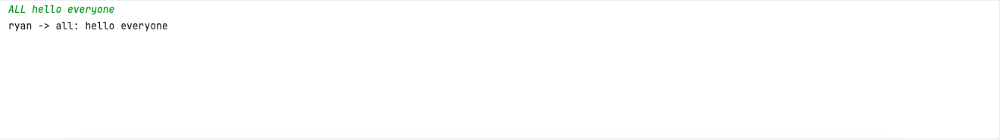
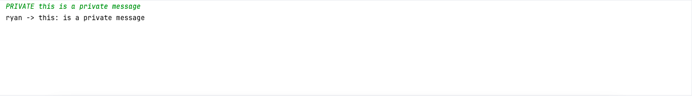

# Network-Socket-Chat-Program
This program listens on ports: 5000, 10000  
Client's writing socket -> Server's reading socket : port 5000  
Server's writing socket -> Clients's reading socket : port 10000  
___
## Set Up:
1. Download both server.py and client.py Python files.
2. Run the ``server.py`` file
3. Run the ``client.py`` file
4. ``dummy_client.py`` can be used for testing with another client if needed  

___
## Sending Messages
There are 3 types of messages you can send:
* **Broadcast Message**
  Broadcast messages are sent to whoever is actively connected to the server.
> ALL  *message contents*  
### E.G.  
  
* **Private Message**
  Private messages can be sent to an individual who is actively connected to the server.
> PRIVATE **receiver's username**  *message contents*
### E.G.  
   
* **Exit Message**
  Exit messages are used to disconnect from the server after communicating.
  When exiting the program, you will be prompted with a confirmation to leave and your connection will be disconnected.
> EXIT
### E.G.  
 
___
